# RiftLite Web Replay System Handover

Last verified: 2026-07-12
Release baseline: RiftLite `v0.8.03` (package SemVer `0.8.3`)
Production website: `https://www.riftlite.com`
System status: Atlas live/account-linked; isolated TCGA local adapter validated but not deployed or auto-uploaded

This is the durable technical and product handover for the complete RiftLite Web Replay system. Read this document together with `docs/CURRENT_STATE.md` before changing replay capture, upload, account authentication, replay privacy, Discord delivery, normalization, the web player, or the desktop embed.

## 1. Non-negotiable working rules

1. Preserve both dirty working trees. Never reset, discard, clean, or broadly reformat them.
2. Do not rebuild installers, deploy Vercel, publish releases, send Discord messages, or mutate production data unless the user explicitly asks.
3. The canonical desktop source is:
   `C:\Users\cdfpa\OneDrive\Documents\Claude\Projects\Riftlite Beta 0.6\desktop-v06`
4. The canonical website source is:
   `C:\Users\cdfpa\OneDrive\Documents\Claude\Projects\RiftLite-website`
5. Do not use `C:\Users\cdfpa\OneDrive\Documents\Claude\Projects\RiftLite` or the old 0.8 experiment as implementation sources.
6. The desktop repository has deliberately separate GitHub remotes:
   - `windows` -> `cdfpartridge-web/RiftLite-Desktop`
   - `origin` -> `cdfpartridge-web/RiftLite-Desktop-mac`
7. The website repository is currently on `codex/riftreplay-preview-20260703` and is intentionally dirty. Production was deployed from that preserved state.
8. Raw Atlas data can contain names, chat, room codes, hidden cards, deck data, and match state. Treat it as security-sensitive even when the processed replay is Public.
9. The old third-party RiftReplay uploader, old local reconstructed Replay Lab, first-party Web Replay V2, and normal video replay system are different systems. Do not merge their consent or storage paths.

## 2. Product intent and frozen reference

The goal was to reproduce the useful behaviour of RiftReplay's web player with RiftLite branding and an independent implementation. The desired result is a video-like replay rather than a slideshow:

- one continuous 16:9 stage;
- RiftReplay-like board placement and opening sequence;
- semantic animations for card and state changes;
- deterministic seeking;
- BO1 and continuous BO3 playback;
- animated sideboarding, mulligans, deck inspection, and game transitions;
- a website-first player embedded unchanged inside the Electron client.

The public behaviour reference was frozen on 2026-07-09, primarily against:
`https://riftreplay.com/rl/rp_cd9d5f0ab9`.

The implementation is intentionally not a source-code copy. Reference defects are not reproduced. Technical truth, privacy, and deterministic behaviour take priority over copying a mistake. The detailed visual/interaction contract is also recorded in the website file `docs/replay-v2-reference.md`.

Primary acceptance viewport is 1920 x 1080. The player uses a fixed 1920 x 1080 design canvas and uniformly scales the entire scene. The intended minimum desktop viewport is 1280 x 720. Mobile is not a current requirement.

## 3. Terminology: four replay systems

### 3.1 RiftLite Web Replay V2

The live first-party system described by this handover. It captures Atlas WebSocket traffic locally, uploads a private raw artifact to RiftLite.com, normalizes it server-side, and serves a privacy-filtered canonical replay to the website player.

### 3.2 Normal RiftLite video replay

The desktop video/keyframe replay and coaching system. It creates `ReplayRecord` video assets, clips, flags, drawings, voice notes, and exports. Web Replay V2 does not depend on video capture being enabled and does not upload video media.

### 3.3 Old local reconstructed Replay Lab

The parked local raw-data viewer using `src/shared/riftLiteReplayEngine.ts` and `src/renderer/RiftLiteReplayViewer.tsx`. Keep the code for diagnostics, but do not re-expose it as the user-facing Web Replay player.

### 3.4 Legacy third-party RiftReplay upload

The API-key flow to `https://riftreplay.com/api/v1/replays`. It uses `rawCapture.uploadEnabled`, `endpoint`, and `apiKey`. It is separate from first-party Firebase account consent and should remain off unless deliberately used for legacy diagnostics.

## 4. Current repositories and deployed baseline

### Desktop

- Source: `desktop-v06`
- Branch: `main`
- Package: `riftlite-desktop-v08`, version `0.8.3`
- Windows release: `https://github.com/cdfpartridge-web/RiftLite-Desktop/releases/tag/v0.8.03`
- macOS release: `https://github.com/cdfpartridge-web/RiftLite-Desktop-mac/releases/tag/mac-v0.8.00`
- Application ID and user-data folder still use the Beta 0.6 identity to preserve upgrades and existing data.

### Website

- Source: `RiftLite-website`
- Framework: Next.js 16, React 19, TypeScript, Firebase Admin/Client, Vercel Blob, Vercel hosting
- Production Vercel project: `riftlite`
- Production alias: `https://www.riftlite.com`
- Current website deployment: `dpl_GaGtmmMEdcz7ujPoTFrxX6ZJ9Mtg` (generation-2 Unlisted Replay Combiner with Atlas-specific battlefield Hidden-card labels)
- `/replays` is linked from the main navigation and homepage hero.
- `/replays/combine` is live but intentionally hidden from normal replay-library navigation while manual testing continues.

## 5. End-to-end architecture

```mermaid
flowchart LR
    A["Atlas game WebSocket"] --> B["Game preload tap"]
    A --> C["Electron debugger fallback"]
    B --> D["Central Atlas frame deduper"]
    C --> D
    D --> E["RawCaptureService session map"]
    E --> F["Local raw JSON + sidecar manifest"]
    F --> G["gzip + SHA-256"]
    G --> H["POST init"]
    H --> I["PUT immutable raw artifact"]
    I --> J["POST complete"]
    J --> K["Parse and normalize canonical V2"]
    K --> L["Immutable canonical artifact"]
    L --> M["Public, Unlisted, or owner-only API"]
    M --> N["Website ReplayV2Player"]
    N --> O["Dedicated Electron replay webview"]
    J --> P["Optional Discord reports delivery"]
```



The raw artifact is diagnostic input. The canonical artifact is the only playback truth. The player never interprets the private raw capture.

## 6. Desktop consent and account ownership

First-party automatic replay upload is opt-in and account-bound.

The relevant settings are `UserSettings.rawCapture`:

- `enabled`: Atlas raw capture is active.
- `webReplayAutoUploadEnabled`: first-party automatic upload is active.
- `webReplayAutoUploadAccountUid`: UID that granted automatic-upload consent.
- `webReplayDiscordShareEnabled`: future-replay Discord sharing is active.
- `webReplayDiscordShareAccountUid`: UID that granted Discord-sharing consent.
- `webReplayDiscordShareHubIds`: selected private-hub IDs, maximum ten server-side.
- `visibility`: `private`, `unlisted`, or `public`.
- `uploadEnabled`, `endpoint`, `apiKey`: legacy third-party RiftReplay settings only.

Defaults are capture off, first-party upload off, Discord sharing off, legacy upload off, and Private visibility.

The UI is available in both Settings and Account. Enabling automatic Atlas uploads requires:

- a linked `accountUid`;
- a Firebase refresh token;
- successful account verification;
- no current account-verification error.

Consent is valid only when the active account UID exactly equals the consent UID. Switching or unlinking accounts revokes it. Account cloud backup/restore also strips replay-upload consent so another device must opt in independently.

Selecting a private hub under **Automatically post future replay links** is the complete Discord opt-in. It automatically:

- enables raw capture;
- enables first-party automatic upload;
- binds both consents to the current account UID;
- forces new shared captures to Unlisted;
- records the exact selected hub IDs.

Removing the last hub disables Discord sharing but does not silently erase unrelated local raw captures.

## 7. Desktop WebSocket capture

### Sources

Atlas frames arrive through two paths:

1. `src/game-preload/gamePreload.ts` wraps the Atlas WebSocket and sends `raw-capture:frame` IPC.
2. `src/main/main.ts` uses Electron's Chromium debugger Network domain as a fallback.

Both paths pass through `AtlasFrameDeduper` before raw capture or event deck tracking. The preload is primary. Recent preload traffic suppresses debugger frames for 15 seconds. Cross-source duplicates are fingerprinted using stream ID, direction, and raw payload and suppressed within two seconds.

Do not bypass this central ingestion function. Doing so can duplicate raw messages, replay actions, and deck-tracker state.

### Capture limits and filter policy

The desktop in-memory session limit is:

- 10 MiB uncompressed raw text;
- 12,000 frames.

When capped, the session records a failure and stops buffering. The website parser permits up to 50,000 messages, but the current desktop intentionally has the lower cap.

`presence_update` is marked with a drop reason under filter policy version 2. Transport/presence packets are retained or compacted diagnostically but do not become duplicate semantic board actions.

### Keyed session association

`RawCaptureService` maintains a map of active sessions instead of one global session. Evidence is matched in this order:

1. capture-session identity;
2. series identity;
3. match identity;
4. replay identity;
5. current or previous room code;
6. a single unambiguous session inside a strict temporal window.

Important windows are:

- up to 15 minutes of prelude before the match;
- up to 3 minutes between final captured traffic and completion;
- up to 6 hours total match duration.

Identity-free matchmaking frames begin in a provisional transport session. Later authoritative series, prior-room, or game evidence can merge that provisional session into a genuine BO3 continuation. A room change alone does not split a series when stronger series evidence says it is the same BO3.

If no unique session matches, finalization fails closed and surfaces a non-sensitive association error. It must never attach the nearest arbitrary session.

### BO3 session behaviour

A BO3 is one raw series capture with multiple game/lifecycle segments. Child games retain their room, match, replay, game number, phase, and source sequence evidence. A room change between games is expected. Sideboarding and setup are not match completion.

The match tracker separately protects child-game identity using tracker session, ordinal, explicit game number, and result-event identity. Equal results and scores are not sufficient deduplication evidence.

## 8. Match completion and local persistence

`CaptureCoordinator.finalizeReplayForDraft` constructs a `RawCaptureFinishIdentity` from the final match draft and raw evidence, including:

- platform;
- capture, room, series, match, and replay IDs;
- local match/replay IDs;
- title and timestamps;
- privacy-safe match result summary.

Raw completion runs even when normal video replay capture is disabled or the user chose not to keep the video replay.

The raw JSON and adjacent index manifest are written atomically to:

`<Replay folder>\Raw Capture\`

Default base folder:

`%USERPROFILE%\Documents\RiftLite\Replay Bundles\Raw Capture\`

Each raw file has an adjacent:

`*.riftlite-index.json`

The index is `riftlite-raw-capture-index` version 1 and stores local identity, upload state, checksum, remote replay ID/URL, visibility, processing status, account-bound eligibility, and Discord delivery state. This manifest is the recovery source when a raw-only capture has no normal `ReplayRecord` or when the app restarts before association.

The local raw wire envelope remains `riftreplay-raw-capture` version 1 for compatibility. RiftLite extensions include:

- capture identity and all known room/match/replay IDs;
- lifecycle boundaries;
- phase segments;
- game segments with inclusive source ranges;
- sockets and filter statistics;
- optional privacy-safe desktop match summary.

The match summary contains only format, perspective-relative series/game results, and points. It does not include names, UIDs, room codes, battlefield names, chat, decks, or notes. The server uses it only to restore missing results when raw evidence lacks them; raw-derived results remain authoritative.

## 9. Automatic upload and recovery

### Upload sequence

The desktop:

1. reads the exact local JSON;
2. gzips it;
3. calculates SHA-256 and compressed byte length;
4. rejects compressed payloads above 4 MiB;
5. refreshes the linked Firebase ID token;
6. rechecks exact UID and consent before every protocol step;
7. initializes, uploads when required, completes, and persists the permanent URL.

The three HTTP steps are:

- `POST /api/v2/replays/init`
- `PUT /api/v2/replays/{replayId}/raw`
- `POST /api/v2/replays/{replayId}/complete`

Only exact same-origin `https://www.riftlite.com` Replay V2 endpoints are accepted. Redirects are rejected. Tokens are never sent to the legacy RiftReplay endpoint.

### Retry behaviour

Capture ID plus owner UID deterministically produces the same remote replay ID. The checksum prevents a changed payload from being registered under the same capture ID.

Pending uploads are retried:

- at app startup;
- after relevant settings/account changes;
- every two minutes while the feature is enabled.

The retry scan covers normal replay records and orphan raw manifests. It retries not-uploaded/failed captures, incomplete processing, missing first-party URLs, and eligible partial Discord delivery. A two-minute per-capture cooldown prevents tight retry loops. `too-large` captures are not retried automatically.

Automatic upload eligibility is snapshotted when the raw session begins and revalidated at completion. A mid-match account switch, opt-out, or hub-selection change fails closed. This prevents one account's capture being uploaded to another account.

## 10. Replay V2 API contract

All routes are dynamic Node.js routes and return `Cache-Control: no-store` for replay metadata and canonical data.

| Route | Auth | Purpose |
| --- | --- | --- |
| `POST /api/v2/replays/init` | Firebase bearer, durable linked identity | Declare capture ID, hash, size, visibility, metadata; reserve deterministic replay ID |
| `PUT /api/v2/replays/{id}/raw` | Firebase bearer, owner | Upload gzip bytes with declared hash and length headers |
| `POST /api/v2/replays/{id}/complete` | Firebase bearer, owner | Normalize and atomically activate a canonical generation |
| `GET /api/v2/replays/{id}` | Public/Unlisted anonymous; Private owner bearer or embed cookie | Return gzip canonical JSON, or 202 processing summary |
| `PATCH /api/v2/replays/{id}` | Firebase bearer, owner | Change visibility |
| `GET /api/v2/replays?scope=public` | None | List Public ready replay summaries |
| `GET /api/v2/replays?scope=mine` | Bearer or read-only embed cookie | List owner replays |
| `GET /api/v2/replays/{id}/diagnostics/raw` | Firebase bearer, owner | Download private raw gzip for diagnostics |
| `POST /api/v2/replay-embed-session` | Firebase bearer | Create short-lived HttpOnly embed cookie |
| `POST /api/v2/replays/{id}/share-discord` | Firebase bearer, owner | Force Unlisted and deliver to selected hub report channels |
| `POST /api/v2/replays/combine` | Firebase bearer | Create consented combined replay from two canonical sources |

Initialization accepts capture ID, SHA-256, compressed byte length, visibility, title, platform, local replay ID, match ID, series ID, room code, message count, and captured time. Identifiers are bounded and control characters are rejected.

Current limits:

- init JSON: 64 KiB;
- visibility JSON: 8 KiB;
- raw gzip: 4 MiB;
- expanded raw JSON: 32 MiB;
- canonical JSON: 32 MiB;
- canonical gzip: 4 MiB;
- source messages: 50,000;
- default library list: 48;
- maximum library list: 100.

There is currently no deletion API and no cursor pagination. Filters and sorting operate client-side over the fetched list.

## 11. Authentication model

Replay mutations require a verified Firebase ID token containing at least one durable non-anonymous provider identity. The code intentionally does not trust only `firebase.sign_in_provider`, because a desktop account can begin anonymously and retain that label after Google/email identities are linked.

A pure anonymous token, malformed token, expired token, or token without durable provider identities is rejected.

Private embedded reads use a separate ten-minute HMAC-signed cookie:

- cookie: `riftlite_replay_session`;
- `Secure`;
- `HttpOnly`;
- `SameSite=Lax`;
- site-wide path;
- secret: `REPLAY_EMBED_SESSION_SECRET`, minimum 32 bytes.

The cookie grants only owner listing and Private canonical playback. Uploads, visibility changes, raw diagnostics, combination, and Discord sharing still require a bearer token.

## 12. Deterministic identity and server state machine

Replay IDs use:

`rl2_` + first 32 hexadecimal characters of SHA-256 over namespace, owner UID, and capture ID.

This makes retries idempotent per owner. The same capture ID under another owner is a different replay. The same owner/capture with a different checksum or byte length is rejected as a content conflict.

Server statuses are:

- `uploading`: initialized and/or raw stored, canonical not active;
- `processing`: one completion generation owns the processing lease;
- `ready`: canonical artifact is active;
- `failed`: bounded failure code/message is retained for the owner.

The processing lease is 90 seconds. Concurrent completion calls wait briefly for the active generation and otherwise return a retryable processing conflict. A canonical pointer is switched only after parsing, normalization, compression, artifact storage, and checksum metadata succeed.

## 13. Firestore and artifact storage

### Firestore metadata/index collections

- `replayV2/{replayId}`: authoritative record and active artifact pointers.
- `replayV2Owners/{uid}/items/{replayId}`: owner-specific summary index, including capture ID, room code, and failure details.
- `replayV2Public/{replayId}`: privacy-safe Public-only discovery index.
- `replayV2Artifacts/{artifactId}`: optional Firestore chunk fallback metadata.
- `replayV2Artifacts/{artifactId}/chunks/{index}`: optional base64 chunks.
- `replayDiscordShares/{shareKey}`: idempotent Discord delivery claims.

Unlisted replays are never inserted into `replayV2Public`. Private and Unlisted replays remain in the owner index.

### Vercel Blob

Private Vercel Blob is the default artifact store. Paths are immutable and include kind, replay ID, generation, and SHA-256:

`replay-v2/{raw|canonical}/{replayId}/{generation}-{sha256}.json.gz`

Writes use private access, no random suffix, no overwrite, and a maximum-size guard. Every read verifies expected byte length and SHA-256.

### Firestore fallback

The Firestore chunk fallback is disabled unless:

`REPLAY_V2_ALLOW_FIRESTORE_ARTIFACTS=enabled`

It uses 450,000-character base64 chunks with a maximum of 24 chunks. Client Firestore rules must deny all direct access to every Replay V2 collection. Only Admin SDK server routes may read or write replay metadata/artifacts.

Immutable orphan artifacts are possible if a transaction loses the race after artifact storage. There is no current garbage-collection job; never delete blobs based only on age without checking active and historical record pointers.

## 14. Raw parsing and canonical normalization

The normalization pipeline is:

1. validate `riftreplay-raw-capture` version 1;
2. order messages by sequence/source index;
3. parse payloads and normalize monotonic relative time;
4. infer room, series, and perspective player;
5. observe explicit game numbers, phases, instances, results, and scores;
6. correlate action intents with authoritative patch commits;
7. create semantic canonical events;
8. project deterministic state and build checkpoints;
9. apply privacy-safe desktop result metadata only where raw results are absent and mapping is unambiguous;
10. sanitize room/session identities from canonical output;
11. gzip and atomically activate the canonical generation.

Canonical truth rules:

- action intent supplies semantic meaning for animation;
- authoritative snapshot/patch commit supplies state truth;
- an intent without a commit becomes an unknown diagnostic and is not applied;
- unsupported packets and patch operations are retained as unknown events/diagnostics;
- a terminal score of eight can determine a result only after genuine end-of-match evidence;
- no winner is guessed merely because someone was ahead at capture end;
- desktop result metadata never replaces a raw-derived result.

Canonical event kinds are:

- game boundary;
- phase;
- snapshot;
- confirmed action with patch operations;
- chat;
- log;
- interaction/card ping/emote;
- unknown.

Patch operations cover zone insertion/removal/movement, card field set/unset, room/player/board fields, chain changes, log changes, and unknown operations.

The canonical schema is `riftlite-canonical-replay` version 2 and contains source summary, series, participants, games, phases, results, events, unknown events, diagnostics, and checkpoints. It may also contain consented dual-perspective collaboration metadata.

## 15. Privacy projection

Raw artifacts are always private regardless of user-selected replay visibility.

Canonical normalization:

- removes secret-like keys including auth, token, cookie, password, API key, credential, and secret fields;
- removes embedded raw payload fields;
- hides opponent deck, decklist, sideboard, hand, rune deck, card IDs, and equivalent hidden collections;
- turns unknown opponent cards into placeholders;
- clears capture session, room code, game instance IDs, and room-code-like fields;
- replaces leaked private identity aliases inside strings;
- preserves only information legitimately visible from the capture perspective.

Public listing summaries contain player/opponent names and legends, format, and perspective-relative result. Owner summaries may additionally contain capture ID, room code, failure, and diagnostic status.

Visibility meanings:

- **Private**: only the owner can list or play it.
- **Unlisted**: anyone with the permanent link can play it; it is excluded from Public discovery.
- **Public**: anonymously playable and listed in the Public library.

Every canonical/list response is `no-store`. This prevents a replay changed from Public to Private from remaining in a CDN cache.

## 16. Website routes and library

User-facing routes:

- `/replays`: Public and signed-in owner library plus manual upload.
- `/replays/{replayId}`: permanent canonical player route.
- `/replays/embed?embed=1`: desktop embedded library without normal site navigation.
- `/replays/{replayId}?embed=1`: embedded player presentation.
- `/replays/{replayId}?t={seconds}`: shared timestamp.
- `/replays/combine`: direct-only manual dual-perspective tool.

The owner library supports visibility changes and retrying failed/processing completion. Manual upload accepts `.json` and `.json.gz` raw-capture v1 files. JSON is compressed in the browser before upload. Browser limits are 32 MiB expanded and 4 MiB compressed.

Library filters:

- text across title, player, opponent, and legends;
- player legend;
- opponent legend;
- BO1/BO3;
- win/loss/draw/unknown;
- owner-only status;
- owner-only visibility;
- newest, oldest, player legend A-Z, opponent legend A-Z.

Older ready summaries without listing metadata are lazily hydrated from the canonical artifact and written back to the owner/Public indexes.

## 17. Web player behaviour

### Layout

The player is one fixed 1920 x 1080 scene with:

- opponent half at the top;
- perspective half at the bottom;
- base and battlefield lanes;
- landscape battlefield cards with units rendered over their battlefield lane;
- legend/champion, deck, trash, rune cards, hands, points, turn and phase state;
- current-card inspector and Chat/Match Log rail;
- bottom timeline/transport controls.

The board scales uniformly rather than reflowing.

### Opening and BO3 presentation

Game 1 stages are:

1. Matchup;
2. Selected battlefields;
3. Initiative;
4. Opening hands;
5. Mulligan;
6. Game start.

Later games begin with a game transition and add sideboarding when there is a sideboard phase or confirmed `submit_sideboard` action. They then repeat matchup, battlefield, initiative or first-player choice, opening/mulligan where present, and game start.

Presentation stages have fixed base timings scaled by playback speed. Seeking backward reconstructs instantly with motion briefly suppressed. Seeking forward during an animation waits for the current action animation to settle.

### Controls

- Space: play/pause.
- Left/Right: previous/next action.
- Shift+Left/Right: previous/next game.
- Alt+Left/Right: previous/next turn.
- `1`, `2`, `4`: playback speed.
- `M`: More/Less controls.
- `?`: shortcut help.
- Escape: close overlays/help.
- Fixed rewind/forward: 15 seconds.
- Timeline seek, game navigation, turn navigation, start/end, fullscreen, share, and frame capture.

Frame capture uses browser display capture with video only. The desktop replay partition grants it only to the exact replay main frame after a user gesture.

### Card and mechanic handling already implemented

- Legend/champion art in opening scenes and board rails.
- Champion-zone rendering uses only the card physically in that live zone. A champion played onto the board no longer remains visually duplicated in the champion zone.
- Battlefield cards render horizontally in the board, opening scene, inspector, and hover preview.
- Battlefield ownership uses player seat/zone evidence. During sideboarding/battlefield selection, option lists are not treated as confirmed choices.
- Mulligan compares opening and submitted hands, animating cards leaving/entering where action evidence exists.
- Sideboarding reads the confirmed perspective-player `submit_sideboard` action and displays exact Out/In quantities. Opponent choices remain locked unless the replay is a consented combined replay.
- Deck peek is a stable single scene keyed to player/game/revision. Candidate cards appear progressively; chosen cards animate to Hand, Trash, or Base; explicit reveals are tagged; unchosen cards return on clear.
- Rune cards remain visible and interactive; the removed visual was the old decorative egg counter, not rune cards.
- Duplicate cards show a Duplicate tag from `isDuplicate`.
- Custom labels render as tags.
- Explicit `whiteCounter` and `redCounter` values render, including zero and negative values.
- Equipment uses `attachedToCardId` and renders beneath its host with the lower/right portion visible. Multiple, nested, orphan, self, and cyclic relationships are guarded so cards are not lost.
- Token images have explicit Atlas mappings for Bird, Gold, Mech, Recruit, Sand Soldier, and Sprite.
- Trusted direct art hosts are allowlisted; card-code fallback uses Piltover Archive CDN.
- Trash piles open a browse overlay; hover/click produces a large card preview.
- Hovered cards take priority in the inspector; selected/current cards are fallbacks.
- Target arrows, card emphasis, pings, chat, logs, chain state, score, and turn markers are time-synchronised.

## 18. Desktop embed security

The desktop tab is called **RiftLite web replay** and embeds the website player/library in partition:

`persist:riftlite-replay`

That partition is identified before game-webview setup, so it never receives Atlas/TCGA debugger taps or game capture hooks.

Security rules:

- top-level navigation is limited to exact `https://www.riftlite.com/replays` paths;
- unexpected HTTP(S) navigation opens in the system browser;
- popups are denied;
- permissions are denied except exact replay-frame fullscreen, sanitized clipboard write, and video display capture;
- display capture requires the exact main frame, a user gesture, video requested, and no audio;
- cookies are cleared at app startup, before each bootstrap, on link/account identity change, and on unlink;
- an auth generation prevents an in-flight old-account bootstrap restoring a stale cookie.

The main process refreshes the linked Firebase token, posts it in an Authorization header to the embed-session endpoint using the dedicated Electron session, verifies the Secure/HttpOnly cookie was stored, then loads the embed URL. The token never enters renderer state, URLs, local storage, or webview JavaScript.

If authentication fails, the same page loads anonymously, the website switches to Public replays, and the desktop shows reconnect guidance plus an Account button instead of a blank owner library.

## 19. Discord private-hub replay reports

Automatic Discord replay posting is separate from the ordinary private-hub match feed.

Replay links use each hub's configured `reports_channel`, not `feed_channel`.

For a first automatic Discord-eligible upload, the desktop checks the current persisted match result before creating the immutable Replay V2 artifact. If the result is unresolved, it waits 15 seconds and then polls every 2.5 seconds for up to 30 seconds total. When Atlas finalization arrives, the desktop refreshes the privacy-safe raw `matchSummary` and only then uploads and shares. This delay applies only to the first automatic Discord-sharing attempt; manual existing-replay sharing and ordinary non-Discord upload timing are unchanged. A restart/retry can refresh immediately when the local match is already resolved.

When sharing:

1. the server authenticates the replay owner;
2. the replay is changed to Unlisted before delivery;
3. the canonical artifact must be Ready;
4. current hub membership is checked across canonical identity aliases;
5. each linked guild must have a reports channel;
6. the message is posted with mentions suppressed by text escaping;
7. a Firestore claim and deterministic Discord nonce prevent duplicates.

The message contains only:

- player versus player;
- legend versus legend;
- BO1/BO3;
- series or game score;
- permanent Unlisted replay URL.

It excludes raw capture, room code, UIDs, diagnostics, notes, chat, and private hub data.

Claims are keyed by replay, hub, and guild. `posting` claims are treated as in progress for 60 seconds. Successful destinations remain `posted` when another selected hub fails, allowing safe partial retry without duplicate successful posts.

Important behaviour: if Discord delivery fails after visibility changes, the replay remains Unlisted. Do not silently revert visibility because a link may already have been shared or a retry may be pending.

Manual existing-replay sharing is available from replay details after confirmation. Existing historical replays are never swept automatically merely because a hub is selected.

For BO1 messages, a known winner is rendered as match score `1-0` or `0-1`. Battlefield points are only a fallback when no winner is available. BO3 scores continue to count game winners.

## 20. Dual-perspective Replay Combiner

The prototype is live at `/replays/combine` but hidden from the normal library.

It accepts two Replay V2 IDs/links and requires:

- a signed-in creator;
- explicit confirmation that both players consented;
- two distinct Ready canonical sources;
- normal access to both sources: creator-owned Private is allowed, another owner's source must be Unlisted or Public;
- the same two Atlas player IDs;
- opposite perspective-player IDs;
- compatible format, game count/numbers, and non-conflicting results;
- strong match identity or authoritative event alignment.

Identity confidence:

- exact: same private series or match ID;
- strong: same room plus compatible timing/event evidence, or same canonical series;
- review: very strong authoritative event fingerprint without shared private identity.

Shared-room timing windows are 90 minutes for BO1 and four hours for BO3. Basic event alignment requires at least two common events, one common action, and 50% coverage. Strong event alignment requires at least four common events, two common actions, and 85% coverage.

Authoritative action identity is perspective-invariant: game ordinal plus authoritative sequence (or client action identity when sequence is absent) plus action type. `actorPlayerId` is deliberately not part of the pairing key because the perspective that sent an intent may know the actor while the opposite capture legitimately does not. When paired, one known actor enriches a missing actor; two different known actors remain a material conflict. Perspective-filtered patch-operation shape is also not match-identity evidence because hidden moves can normalize as `zone_move` for the owner and redacted remove/insert operations for the opponent.

The more complete replay becomes the one deterministic timeline. Matching snapshot/action events are paired by game ordinal plus authoritative sequence or client action identity. The second source only enriches hidden fields/cards that its perspective legitimately captured. Secondary commits are never appended and applied twice. Any material public-state conflict aborts the merge.

During patch enrichment, owner-only operations may be added when the primary perspective omitted them, redacted remove/insert transitions are reconciled with the owner-visible move, and known consented hidden cards are preserved across a later unpaired masked snapshot when zone shape is unchanged. Actual conflicts between two supplied public values still abort rather than being treated as redaction.

The output:

- is a third separate replay;
- is deterministic and retry-safe from sorted source IDs/checksums;
- has no raw artifact;
- is Unlisted by default and owned by the creator, so anyone with the link can view it while it remains absent from public listings;
- records immutable source IDs/checksums and consent provenance;
- rebuilds checkpoints;
- shows both captured hands, mulligans, deck choices, and sideboards;
- retains unresolved placeholders rather than guessing.

The next required validation is one short real Atlas BO1 captured and uploaded by both players, with the non-creator source made Unlisted.

## 21. Required environment configuration

Do not record secret values in this document, source, diagnostics, or chat. Required/related variable names are:

### Firebase Admin

- `FIREBASE_SERVICE_ACCOUNT_JSON`, or all of:
  - `FIREBASE_PROJECT_ID`
  - `FIREBASE_CLIENT_EMAIL`
  - `FIREBASE_PRIVATE_KEY`

### Firebase client

- `NEXT_PUBLIC_FIREBASE_API_KEY`
- `NEXT_PUBLIC_FIREBASE_AUTH_DOMAIN`
- `NEXT_PUBLIC_FIREBASE_PROJECT_ID`

### Replay storage/auth

- `BLOB_READ_WRITE_TOKEN`, or Vercel OIDC plus `BLOB_STORE_ID`
- `REPLAY_EMBED_SESSION_SECRET` (at least 32 bytes)
- optional `REPLAY_V2_ALLOW_FIRESTORE_ARTIFACTS=enabled`
- optional `NEXT_PUBLIC_SITE_URL` (production fallback is `https://www.riftlite.com`)

### Discord

- `DISCORD_APPLICATION_ID` or `DISCORD_CLIENT_ID`
- `DISCORD_COMMUNITY_BOT_TOKEN` or `DISCORD_BOT_TOKEN`
- `DISCORD_PUBLIC_KEY`
- `RIFTLITE_BOT_API_TOKEN` where the bot API path requires it

## 22. Key source map

### Desktop capture/upload/embed

- `src/game-preload/gamePreload.ts`: primary WebSocket capture.
- `src/main/main.ts`: debugger fallback, central ingestion, IPC, embed security, retry startup.
- `src/main/services/atlasFrameDeduper.ts`: cross-source dedupe and debugger fallback gate.
- `src/main/services/rawCaptureService.ts`: session association, local files/manifests, V2 upload, retries, Discord share.
- `src/main/services/captureCoordinator.ts`: match completion and raw finalization identity.
- `src/main/services/matchSessionTracker.ts`: BO1/BO3 match/game identity and results.
- `src/main/services/replayEmbedSession.ts`: cookie bootstrap and exact replay URLs.
- `src/main/services/firebaseSync.ts`: linked account token refresh/verification and account lifecycle.
- `src/main/services/store.ts`: defaults, migration, normalization, and local persistence.
- `src/shared/types.ts`: all IPC and replay metadata contracts.
- `src/shared/replaySharing.ts`: one-step hub selection/consent transformation.
- `src/preload/appPreload.ts`: typed renderer IPC surface.
- `src/renderer/App.tsx`: Account/Settings controls, replay tab, replay details/manual retry.
- `docs/replay-v2-desktop.md`: focused desktop security/protocol notes.

### Website API and storage

- `src/app/api/v2/replays/init/route.ts`
- `src/app/api/v2/replays/[replayId]/raw/route.ts`
- `src/app/api/v2/replays/[replayId]/complete/route.ts`
- `src/app/api/v2/replays/[replayId]/route.ts`
- `src/app/api/v2/replays/route.ts`
- `src/app/api/v2/replay-embed-session/route.ts`
- `src/app/api/v2/replays/[replayId]/diagnostics/raw/route.ts`
- `src/lib/replay-v2-server/service.ts`: state machine and indexes.
- `src/lib/replay-v2-server/artifacts.ts`: Blob/Firestore immutable artifacts.
- `src/lib/replay-v2-server/auth.ts`, `identity.ts`, `session.ts`: bearer and embed authentication.
- `src/lib/replay-v2-server/contracts.ts`, `model.ts`, `constants.ts`, `ids.ts`: server contracts.
- `src/lib/replay-v2-server/projection.ts`: canonical identity stripping and summaries.

### Canonical engine and player

- `src/lib/replay-v2/types.ts`: raw and canonical schemas.
- `src/lib/replay-v2/parse-raw-capture.ts`: envelope/message parsing.
- `src/lib/replay-v2/derive-replay.ts`: game/phase/action derivation.
- `src/lib/replay-v2/normalization.ts`: snapshots, cards, patches, logs, chat.
- `src/lib/replay-v2/perspective.ts`: hidden-information policy.
- `src/lib/replay-v2/project-state.ts`: deterministic reducer.
- `src/lib/replay-v2/checkpoints.ts`, `seek.ts`: checkpoints and reconstruction.
- `src/components/replay-v2/model.ts`: board/card interpretation and art resolution.
- `src/components/replay-v2/ReplayV2Player.tsx`: presentation, board, animations, controls.
- `src/components/replay-v2/ReplayV2Player.module.css`: fixed scene and animation styling.
- `src/components/replay-v2/deck-peek.ts`: stable deck-inspection presentation.
- `src/components/replay-v2/library/ReplayLibrary.tsx`: library, manual upload, visibility, filters.

### Combine and Discord

- `src/lib/replay-v2/combine-replays.ts`
- `src/lib/replay-v2-server/combine-service.ts`
- `src/app/api/v2/replays/combine/route.ts`
- `src/components/replay-v2/combine/ReplayCombiner.tsx`
- `src/lib/discord/replay-share.ts`
- `src/lib/discord/replay-share-server.ts`
- `src/app/api/v2/replays/[replayId]/share-discord/route.ts`

## 23. Local diagnostics and recovery locations

Desktop user-data folder remains:

`%APPDATA%\RiftLite Beta 0.6\`

Important files:

- `riftlite-v06.sqlite`: primary local database.
- `riftlite-v06-store.json`: legacy settings/store source where present.
- `riftlite-capture-events.jsonl`: capture diagnostics.
- `riftlite-capture-diagnostics-*.json`: exported diagnostic bundles.
- `riftlite-startup.log`: startup and background retry failures.

Raw captures and manifests are under the configured replay folder's `Raw Capture` subdirectory.

For a missing upload, inspect in this order without restarting first:

1. current raw-capture status/error in the app;
2. the newest raw JSON and adjacent index manifest;
3. local replay record `rawCapture` metadata in SQLite/export;
4. capture diagnostics for frame/session identity;
5. startup log for retry/auth/network failures;
6. website owner library/status;
7. server response/error code.

A raw JSON plus valid index can be retried after restart. An in-memory session that was never persisted cannot be reconstructed after process exit.

## 24. Testing commands

### Desktop focused replay tests

```powershell
npx vitest run tests/rawCaptureService.test.ts
npx vitest run tests/replayEmbedSession.test.ts
npx vitest run tests/replaySharing.test.ts
npx vitest run tests/atlasFrameDeduper.test.ts
npx vitest run tests/matchSessionTracker.test.ts
npx vitest run tests/accountIdentity.test.ts
```

Desktop full verification:

```powershell
npm test
npm run lint
npm run build
```

Do not run `npm run electron:build` unless rebuilding was explicitly requested.

### Website focused replay tests

```powershell
npx vitest run src/lib/replay-v2/parse-raw-capture.test.ts
npx vitest run src/lib/replay-v2/normalize-replay.test.ts
npx vitest run src/lib/replay-v2/project-seek.test.ts
npx vitest run src/lib/replay-v2-server/contracts.test.ts
npx vitest run src/lib/replay-v2-server/service.test.ts
npx vitest run src/components/replay-v2/ReplayV2Player.test.ts
npx vitest run src/components/replay-v2/deck-peek.test.ts
npx vitest run src/components/replay-v2/library/ReplayLibrary.test.ts
npx vitest run src/lib/replay-v2/combine-replays.test.ts
npx vitest run src/lib/replay-v2-server/combine-service.test.ts
npx vitest run src/lib/discord/replay-share.test.ts
```

Website full verification:

```powershell
npm test
npx tsc --noEmit
npm run lint
npm run build
```

Use Playwright for real 1920 x 1080 scene comparisons, BO3 transitions, exact card states, backward seek, and browser console/network errors.

## 25. Troubleshooting matrix

### Completed match did not upload

Check that it was Atlas, account verification is current, `enabled` and account-bound auto upload are true, capture consent UID matches active UID, the raw sidecar exists, the gzip is below 4 MiB, and the index is not `too-large`. Then inspect association errors and the two-minute retry timestamp.

### Older/random replays uploaded instead of the newest one

The retry scan may be draining eligible failed manifests. Verify the newest match produced a persisted manifest and that its capture-start consent UID/hub set still matched at completion. Do not delete older manifests to hide the real association failure.

### Embedded My Replays is blank or mostly black

Check `POST /api/v2/replay-embed-session`, `REPLAY_EMBED_SESSION_SECRET`, Secure/HttpOnly cookie storage in `persist:riftlite-replay`, exact account UID, and `/api/v2/replays?scope=mine`. A 401 should now fall back to Public plus reconnect guidance; a fully blank frame usually means embed navigation/cookie/session setup failed before the library rendered.

### Browser can see replay but desktop cannot

The browser may have a different signed-in account. Verify the desktop's refreshed-token UID, website profile UID, replay owner UID, and consent UID all match. Never copy browser cookies into Electron.

### Replay remains Processing

Retry completion. Inspect owner-visible failure, raw/canonical artifact access, processing generation and the 90-second lease. Do not create a new capture ID to bypass a recoverable deterministic replay.

### Wrong BO3 result or game collapsed

Inspect explicit game number, result event, tracker session/ordinal, lifecycle game ranges, series continuity, and desktop privacy-safe match summary. Never dedupe solely by result/score/battlefield compatibility.

### Wrong battlefield owner or stale battlefield during sideboarding

Inspect player seat, battlefield A/B zones, confirmed selection fields, phase boundary reset, and canonical checkpoint reconstruction. Option lists are not confirmed selections during sideboarding or battlefield-pick phases.

### Missing card/token image

Inspect card code, direct URL host, source/type, and token name. Add a canonical mapping only when the Atlas token URL is confirmed. Do not allow arbitrary external image hosts.

### Discord replay did not post

Confirm the replay's manifest captured eligible hub IDs, current account still matches, replay became Ready/Unlisted, the user remains a hub member, and the bot has `reports_channel` configured for the exact hub ID. Inspect `replayDiscordShares`, server result status, and manifest `discordShareError`. Do not look only at the ordinary `feed_channel`.

### Discord replay posted Score Pending

Compare raw-capture `completedAt`, manifest upload/share timestamps, and the SQLite match `updatedAt`. Automatic Discord-eligible uploads deliberately wait 15 seconds and poll for up to 30 seconds for a finalized local result. If an older client uploaded first, its canonical replay is immutable and the existing Discord post cannot gain the later result automatically. Verify the current match row became resolved and that the raw/manifest `matchSummary` was refreshed before the init/raw/complete requests.

### Duplicate Discord post concern

Check the deterministic share claim for replay/hub/guild and Discord nonce before manually reposting. A failed hub may be retried without repeating a posted hub.

### Combiner rejects a pair

Confirm same two player IDs, opposite perspectives, same game structure/results, access to both sources, and sufficient private identity or authoritative event alignment. A public-state conflict is a real refusal, not a case for heuristic force-merging.

If two clearly identical perspectives report zero common actions, inspect whether one side has `actorPlayerId` while the other legitimately omits it. Actor presence and perspective-filtered operation shape must not be used as the action identity fingerprint. Compare authoritative game ordinal, patch sequence/client identity, and action type instead.

## 26. Known constraints and deliberate future work

- Local desktop automatic capture/upload now supports Atlas and TCGA through separate account-bound opt-ins and provider-specific collectors. The TCGA promotion is not deployed or published; TCGA remains BO1-only until multi-game channel attribution is implemented.
- Internet required for upload and playback; no offline canonical cache.
- 4 MiB compressed transport limit due Vercel Functions. Future large captures need signed multipart Blob upload without changing init/complete identity semantics.
- No replay deletion/retention UI or artifact garbage collector.
- Library query has no cursor pagination; maximum 100 records are fetched and filtered client-side.
- Manual combine remains direct-link only and requires user-attested consent rather than durable bilateral consent grants.
- Combined replay automation is future work.
- Unknown Atlas packets are preserved diagnostically; new actions should be implemented from authoritative evidence, never guessed from animation expectations.
- The old local reconstructed player remains hidden.
- Raw capture can legitimately contain sensitive chat/names even when canonical playback redacts hidden information.
- Website and desktop version/release operations are separate. A hosted player fix can improve embedded playback without rebuilding the desktop.

## 27. Safe change recipes

### Add a new Atlas action/animation

1. Add a real raw fixture or minimal authoritative packet fixture.
2. Parse/normalize the action and patch without weakening perspective redaction.
3. Project the state deterministically.
4. Add seek/checkpoint regression coverage.
5. Add player animation from the canonical semantic event.
6. Test forward playback, pause mid-animation, backward seek, 2x/4x, BO3 boundaries, and hidden opponent state.

### Add a new card image fallback

1. Verify the canonical card code or official Atlas token URL.
2. Add only to the trusted mapping/host path.
3. Test normal tile, battlefield landscape, inspector, hover preview, and trash overlay.

### Change visibility/auth

1. Update API contract and owner/Public indexes transactionally.
2. Preserve `no-store` and `Vary: Authorization, Cookie` where applicable.
3. Verify pure anonymous denial, durable linked identity acceptance, Private owner access, Unlisted anonymous access, and Public discovery.
4. Re-test embed cookie read-only boundaries.

### Change capture association

1. Use explicit IDs before temporal heuristics.
2. Require uniqueness for fallback association.
3. Test delayed finalization, room changes, provisional prelude merge, concurrent sessions, BO1 after BO3, and restart recovery.
4. Keep TCGA behaviour isolated.

## 28. Next-chat startup prompt

Use this prompt in a fresh task:

> Work from `C:\Users\cdfpa\OneDrive\Documents\Claude\Projects\Riftlite Beta 0.6\desktop-v06`. Read `docs/CURRENT_STATE.md` and `docs/WEB_REPLAY_SYSTEM_HANDOVER.md` completely before doing anything. The website source is `C:\Users\cdfpa\OneDrive\Documents\Claude\Projects\RiftLite-website`. Preserve both dirty working trees. Do not rebuild, deploy, publish, send Discord messages, or discard changes unless I explicitly ask. Continue with: [specific replay task].

Before acting, the next chat should report:

- both `git status --short --branch` outputs;
- which repository/files are in scope;
- whether the change is desktop capture, server/canonical, website player, embed, account, Discord, or combined replay;
- the focused tests it will run;
- whether any external mutation is actually authorized.

## 29. Current verification baseline

At v0.8.00:

- desktop: 24 test files, 251 tests, lint/TypeScript/build passed;
- website: 30 test files, 207 tests, TypeScript/changed-file ESLint/build passed;
- Windows packaged-app smoke launch passed;
- macOS GitHub Actions lint, tests, Intel/Apple Silicon packaging, upload, and release passed;
- production `/` and `/replays` returned 200;
- the production homepage contained both main-navigation and hero replay links.

This document is explanatory source-of-truth, but code and focused tests remain authoritative when they disagree with a stale sentence. Update this handover whenever replay contracts, storage, privacy, authentication, consent, or operational procedures materially change.

## 30. TCGA provider extension validated locally on 2026-07-20

TCGA was added as a sibling provider rather than an Atlas compatibility mode:

- Desktop research finalization creates bounded, deterministic per-channel `riftlite-tcga-raw-capture` version 1 gzip companions. The TCGA Capture Lab reports their paths and safe aggregate counts; exporter failure is non-fatal to the parent research capture, and retention/deletion removes companions with their parent.
- The exporter is called only by TCGA Replay Research Capture. It does not call `RawCaptureService`, Firebase, the Replay V2 HTTP client, Discord, or any upload path.
- Website completion dispatches by the immutable replay platform. `atlas` still executes the original `parseRawCaptureV1` and `normalizeRawCaptureV1` path; `tcga` executes strict TCGA validation and its provider-specific normalizer. Cross-schema inputs and provider-changing retries fail closed.
- TCGA normalization emits opaque player/card/message identities, removes raw source/channel/capture identifiers, and converts opponent/private or uncertain cards to identity-free placeholders before canonical serialization. Result state remains unresolved without authoritative terminal evidence.
- The Akali-versus-Irelia game-02 fixture now produces 478 events and 19 deterministic checkpoints over 12 minutes 47 seconds, with phases `matchup -> battlefield_pick -> first_player_choice -> mulligan -> in_game`, final turn 13 and score 7-7. Canonical JSON is 15,903,791 bytes / 1,453,736 bytes gzip. TCGA `grouppedToId` children inherit the live host zone while grouped, so all 290 projected attachment states remain co-located through Base/B1/B2 movement; explicit detach/discard positions still win. The provider's positional card counters are preserved in the shared white/red counter slots, including explicit zero, updates, and removal.
- Local preview uses `/replays/tcga/{fixtureId}` and `/api/local/tcga-replays/{fixtureId}` only when `NODE_ENV` is not production and `RIFTLITE_LOCAL_TCGA_REPLAY_DIR` is explicitly configured. Only canonical JSON is served; raw research/source capture is never served by this route.

No Vercel deployment, GitHub push/release, Discord action, or production replay/data mutation was authorized for this work.

## 31. TCGA product capture and Replay V2 promotion completed locally on 2026-07-20

- The desktop product collector receives only validated `rtc-channel` and `rtc-data` events for TCGA's `game` data channel. Research-only Network/DOM evidence has no product entry point and is additionally rejected at the main-process event boundary unless the user separately starts the Research Monitor.
- TCGA automatic upload is a separate, default-off, verified-account consent. The consenting UID is captured with the channel and rechecked before registration, authentication, retry, and upload. Account switch/unlink or consent withdrawal clears memory and pending material.
- Replay-ready association uses a strict saved-match time window and requires exactly one clean channel with two players, one outbound perspective, opening state, setup 0-to-10 progression, mulligan evidence, in-game/turn evidence, meaningful history, and both legend and battlefield identities. Invalid/truncated/unavailable/oversized/duplicate/incomplete transport taints the channel. BO3/multi-game matches are rejected.
- If the local result is incomplete, the sole validated candidate is stored as an account-bound non-product gzip plus a privacy-safe integrity sidecar and returns `awaiting-result`; no Replay V2 registration occurs. A later confirmation can recover it from a fresh process, add only the privacy-safe result/paired points, create the production artifact, upload once, and delete the pending pair. Tampering, ambiguity, account mismatch, expiry, and replay-folder changes fail closed.
- Replay-folder changes clear live mid-game state and atomically migrate valid pending pairs to the new private raw-capture directory. Pending retention is seven days with a hard 30-day ceiling; explicit consent withdrawal/purge APIs remove pending files.
- Server completion dispatches on immutable platform. Production TCGA accepts only `riftlite-tcga-web-replay`, clean transport, and Win/Loss/Draw metadata; research companions are local-preview-only. The TCGA normalizer projects authoritative result, paired points, terminal phase, and end boundary, then runs shared timeline/checkpoint and provider-specific privacy verification before persistence.
- TCGA uses the normal authenticated upload, library, canonical API, and player. Combining remains Atlas-only. Discord sharing verifies readiness/result before changing visibility, and Atlas Discord consent does not affect TCGA visibility or delivery.
- Local verification: website 61 files / 411 tests plus production build; desktop 80 files / 629 tests plus the mandatory 49-test account gate, TypeScript/build/package, ASAR inspection, updater checksum validation, and isolated packaged startup smoke. No deployment, publication, Discord action, or production-data write occurred.
