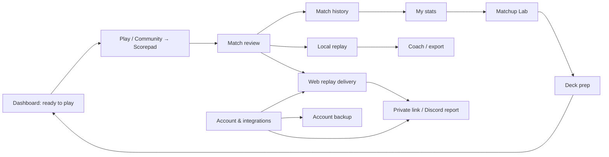

# RiftLite user journeys

Status: product-design proposal only. Proposed journeys reuse the existing capture, match, deck, replay, account, sync, and storage behaviour.

## Shared journey principles

Every journey should answer five questions without requiring knowledge of RiftLite's architecture:

1. **Where am I?** One stable product section and one visible subsection.
2. **Am I ready?** A persistent health summary for the capabilities relevant to the task.
3. **What happens next?** One primary next action, not a field of equal-weight buttons.
4. **What did RiftLite do?** Operation status next to the action, with timestamp and scope.
5. **How do I recover?** Retry, reconnect, repair, or diagnostics only when relevant.

The same presentation states should be used throughout:

| State | User meaning | Required presentation |
| --- | --- | --- |
| Loading | RiftLite is waiting for local or remote data | Name the operation; preserve the surrounding layout; show timeout/retry when appropriate. |
| Empty | The capability works but has no data | Explain why, provide the most useful next action, and show a sample only if clearly labelled. |
| Disconnected | A remote or embedded dependency is unavailable | Preserve local functionality; name which connection is affected; provide retry/browser fallback where valid. |
| Attention | The workflow can continue, but one outcome may be reduced | Explain consequence and offer a scoped fix; do not present it as total failure. |
| Error | The requested operation did not complete | Keep entered data/selection; show bounded error, retry, and diagnostics reference. |
| Success | The intended outcome is complete | Confirm the resulting object/state and offer the natural next action. |

## 1. New user

### Goal and starting point

Install RiftLite, understand its value, play a first match safely, and know where the result went. The user starts at first launch with no local matches, deck, replay, account, or learned terminology.

### Current journey

1. RiftLite shows a generic startup screen.
2. Home presents a broad launchpad with community, media, deck, Scorepad, social, and recent-capture modules.
3. Play presents TCGA/Atlas and a first-run browser/settings strip.
4. Account creation/linking, replay recording, Web Replay upload, active deck, and sync are configured elsewhere.
5. A captured match opens a review modal whose fields assume familiarity with BO1/BO3, decks, flags, sync, and replay state.

### Current friction and information needs

- The user cannot tell which setup is required versus optional.
- “Replays” may mean recorded video or hosted reconstruction.
- Account linking looks more fundamental than it is for local capture, while some account-bound features genuinely require it.
- Capture readiness is visually small and recovery is separated from onboarding.
- The empty Home screen explains many features before the user has a first success.

### Proposed journey

1. **Welcome:** choose the primary use case: “Track online matches,” “Log table matches,” or “Explore first.” This changes emphasis only; it does not disable features or alter defaults.
2. **Choose game:** select TCGplayer (TCGA), RiftAtlas, or Scorepad. Explain what is observed locally.
3. **Required readiness:** verify the embedded game can open and capture health is Ready. Allow “Continue without signing in.”
4. **Optional enhancements:** select an active deck, enable local video recording, or link an account for Web Replays/cloud. Each option states its outcome and privacy boundary.
5. **Dashboard:** show “Ready to track,” the selected game/deck, and one “Start playing” action.
6. **First match:** show unobtrusive detection progress, then open the existing match review.
7. **First success:** after save, show where the match, local replay, and Web Replay (if enabled) can be found.

### Success, empty, error, and disconnected states

- **Success:** “First match saved” with View match and Continue playing.
- **Empty:** dashboard shows three short next steps rather than analytics placeholders.
- **Error:** game surface failure offers Refresh, scoped Atlas Repair when applicable, and Open in browser.
- **Disconnected:** local history, decks, Scorepad, and local replay remain usable; account/community/Web Replay show offline status only in their modules.

## 2. Automatic match-tracking user

### Goal and starting point

Open the correct game, know capture is ready, play without distraction, confirm the result, and continue to the next game. The user usually starts from Home or Play and repeats this flow frequently.

### Current journey

1. Open Play.
2. Choose TCGA or Atlas in the top toolbar.
3. Optionally inspect the sidebar capture-health icon/details rail.
4. Play while deck tracker, prep overlay, capture notices, updater, and recovery prompts may share the surface.
5. On finalization, edit/confirm the match modal.
6. Find the saved result in Matches; separately inspect Replays/Web Replay if wanted.

### Current friction and information needs

- Ready, active, waiting-for-result, and review-needed states are not a single clear sequence.
- The visible game controls mix platform selection, recovery, screenshot, microphone, and diagnostics.
- Pending BO3/sideboard behaviour is intentionally complex but not explained in user language.
- Users need confidence that closing or continuing will not split a series or lose the result.

### Proposed journey

1. Home shows a compact **Tracking readiness** row: game provider, capture status, active deck, local recording, Web Replay upload.
2. “Play” opens an immersive surface with one provider switcher and one status strip.
3. During play, the strip progresses through **Ready → Match detected → Game saved / Series continuing → Review ready** using existing health evidence.
4. Specialist controls live in a labelled utility menu; screenshot and microphone may remain immediate if usage evidence supports them.
5. Match review uses a two-level layout: required result fields first, optional deck/notes/sync/replay fields collapsed but preserving their existing values and actions.
6. Saving shows “Match saved” and the created artifacts: match row, local replay media, Web Replay upload stage.
7. “Continue playing” returns focus to the already-mounted game webview.

### State handling

- **Loading:** “Preparing capture bridge” includes provider and elapsed state, not an indefinite blank.
- **Attention:** “Series may continue” explains that RiftLite is holding the review during BO3/sideboarding; no user action required.
- **Error:** “Capture issue” does not block the game. Offer Retry bridge, provider-specific recovery, and Save a manual review only through the existing safe force-review path.
- **Disconnected:** game page connectivity and RiftLite remote services are separate statuses.
- **Success:** save confirmation includes result/format and a link to Match history.

## 3. Deck and analysis user

### Goal and starting point

Import a deck, make it active, understand performance, prepare specific matchups, and use the guide while playing. The user starts from an external deck list, an existing saved deck, or a weak matchup found in stats.

### Current journey

1. Open Deck Library, import/paste a deck, select it, and set it active.
2. Use separate internal tabs for Library, Prep Guides, Notebook, and Performance.
3. Matchup Prep is also a separate sidebar entry into the same view.
4. Matchup Lab combines personal/community evidence and can jump back to deck sections or replays.
5. During Play, prep and tracker overlays depend on the active deck.

### Current friction and information needs

- Import, active selection, performance, notebook, and prep are one very long conceptual workspace without an overview.
- Users may not realize “active” controls tracker, in-game prep, and overlay statistics.
- Prep sections expose many controls before the user chooses a matchup or goal.
- Matchup Lab and deck performance answer similar questions from different entry points.

### Proposed journey

1. Open **Prepare → Decks**.
2. Deck list shows legend, updated time, active state, version, match count, and readiness.
3. Selecting a deck opens an **Overview** with one primary action: Set active / Active now.
4. Overview summarizes latest version, current record, watchlist alerts, and incomplete prep.
5. Secondary sections are **List**, **Prep**, **Notebook**, and **Performance**. Current persisted data and callbacks map directly to them.
6. From My stats or Matchup Lab, “Prepare this matchup” opens the active deck's Prep section with the opponent preselected.
7. Play shows a compact active-deck chip and contextual prep/tracker access; changing the active deck remains explicit.

### State handling

- **Empty library:** Import deck, Paste deck, and Explore community decks.
- **Invalid import:** preserve input and show source-specific validation without creating a partial deck.
- **No active deck:** explain which features are unavailable; do not imply capture is disabled.
- **No performance data:** show how matches become associated and link to Match history.
- **Unsaved prep:** persistent dirty indicator; save/reset retain current confirmation semantics.
- **Version mismatch:** show current versus match-attributed version without rewriting history.

## 4. Replay and upload user

### Goal and starting point

Find a match, watch available media, understand missing media, create/share a hosted Web Replay, or recover an interrupted upload. The user may start from Match history, Local replays, Web replays, a replay folder, or a Discord link.

### Current journey

1. Local recorded media is under Replays; hosted Atlas reconstructions are under RiftLite web replay.
2. Matches can open a related local replay when evidence exists.
3. Replay details combine playback, health, coaching tools, raw capture upload, Discord share, match data and export.
4. Web Replay setup exists in Account and Settings; the hosted library has its own auth/bootstrap state.
5. Missing media and raw-capture delivery have separate health presentations.

### Current friction and information needs

- Users must understand two replay architectures before knowing where to look.
- “Missing Media” does not immediately distinguish a moved file, an incomplete recording, a raw-only Web Replay, or a replay record with no video.
- Upload/processing/Discord stages are present but not consistently summarized at list level.
- Account mismatch, consent mismatch, webview failure, and website processing can all appear as “replay unavailable.”

### Proposed journey

1. Open **Review → Replays** with two explicit tabs: **Local replays** and **Web replays**.
2. A shared match identity header links the same reviewed match across available artifacts without merging their storage or privacy.
3. Local replay cards show a media state: Ready, Raw evidence only, Missing file, Recording incomplete, or Recoverable file found.
4. Web replay cards show Captured, Waiting for result, Uploading, Processing, Ready, Discord posted, or Needs attention, using the existing delivery-stage helper.
5. Replay detail begins with the best available playback. Coaching and export are grouped under contextual panels.
6. Upload/share actions show current visibility and destination before confirmation. Existing Unlisted/Discord semantics remain unchanged.
7. Import folder and recover media are secondary library actions with a result summary.

### State handling

- **Empty:** explain Local versus Web and provide Record next match / Import media / Enable Web Replay as context permits.
- **Missing media:** show expected file, last known location, safe search/import action, and that match data is still intact.
- **Disconnected Web Replay:** show public/browser fallback while preserving local replay functionality.
- **Account mismatch:** link directly to Account connection verification; never suggest creating a new account.
- **Processing:** show last stage and automatic retry expectations; avoid repeated manual upload prompts.
- **Success:** permanent link, visibility, and Discord destinations are explicit.

## 5. Competitive stats user

### Goal and starting point

Identify weak matchups, separate personal from community evidence, drill into games, and turn findings into deck/prep actions. The user starts from Home insight, My stats, Matchup Lab, or Community meta.

### Current journey

1. Stats provides personal metrics, filters, matrix and drilldowns.
2. Matchup Lab separately combines personal rows, community context, deck comparison, prep and replay evidence.
3. Community Meta & Matrix and Community Decks have their own filters and drilldowns.
4. The user manually transfers a finding into deck prep, flags, or replay review.

### Current friction and information needs

- Data source and denominator are easy to lose across personal/community views.
- Filter density is high and active constraints can be hard to scan.
- Similar legend/matchup cards appear in multiple surfaces without consistent actions.
- Small samples need stronger, consistent language.

### Proposed journey

1. Home shows at most one actionable insight, such as a matchup with enough recent personal evidence.
2. **Review → My stats** defaults to personal reviewed matches and makes source, date, deck and sample size persistent in a filter summary.
3. Selecting a matchup opens a shared drilldown: record, games, seat, battlefields, decks, flags and replay evidence.
4. “Compare with community” opens Matchup Lab with the same matchup context.
5. “Prepare this matchup” opens the active deck prep; “Review evidence” filters local replays/matches.
6. **Community → Meta** always labels its data as public community submissions and keeps it visually distinct from personal results.

### State handling

- **Empty:** link to captured/Scorepad match creation and explain required legend fields.
- **Low sample:** show counts prominently and avoid categorical claims.
- **Filtered empty:** keep active filters visible with Clear filters.
- **Community disconnected:** personal stats remain fully usable.
- **Success:** creating prep or opening replay preserves the selected matchup context.

## 6. Creator or coach

### Goal and starting point

Record reliable media, flag and annotate important moments, produce clips/coaching packs, and expose selected information in OBS. The user starts from Play, Local replays, or Stream overlay.

### Current journey

1. Configure replay video, microphone, shadow clips and hotkeys in Settings.
2. Arm recording through Play focus/pointer behaviour and play the game.
3. Open Replays, select media, inspect health, flag moments, draw, add voice notes/layers, use review mode, and export.
4. Configure Overlay separately with presets, fields, OBS URLs, text files and simulator bridge.

### Current friction and information needs

- Recording readiness is separated from the Play surface and the arming requirement is easy to miss.
- Replay detail exposes playback, health, annotations, coaching pack, flags, raw upload and Discord share at once.
- Creator settings and general settings share one long grid.
- The relation between session reset, match history, active deck stats and output files needs clearer consequences.

### Proposed journey

1. **Creator setup** lives under Settings → Integrations with a readiness checklist for recording, microphone, storage and Stream overlay.
2. Play shows a compact recording status: Off / Ready / Recording / Finalizing / Needs attention.
3. Local Replay detail has modes that change presentation only: **Watch**, **Coach**, and **Export**. Playback state and saved objects remain shared.
4. Coach mode brings flags, layers, annotations, voice notes and review route next to the timeline; health/raw delivery stay in Details.
5. Stream Overlay gets a focused studio layout with preview, source setup, fields and advanced outputs.
6. Copy actions confirm exactly which URL/path was copied and for which layout.

### State handling

- **No permission/device:** preserve video-only use and show Refresh microphones.
- **Recording finalizing:** prevent duplicate actions and show file destination.
- **Missing/incomplete media:** preserve flags/match metadata and offer recovery.
- **Export failed:** keep in/out points and selected layer state for retry.
- **Overlay server starting:** preview can render from local data while copy controls remain disabled with reason.

## 7. Advanced integration user

### Goal and starting point

Connect an existing account, preserve identity and local data, enable cloud/Web Replay/Discord/private hubs, diagnose status, and use specialist integrations without exposing secrets. The user starts from Account, Private Hubs, Settings, or a failure deep link.

### Current journey

1. Account shows link/reconnect, connection verification, replay consent, profile, public sections, cloud, profile search and data controls.
2. Settings repeats Web Replay settings and contains raw capture, backup, diagnostics, updates and tools.
3. Private Hubs contains memberships, Hub Health, Discord configuration outcomes, roles, invites, sync and stats.
4. Replay detail exposes upload/share stages; Web Replay embed has a separate session bootstrap.

### Current friction and information needs

- One “account” appears to have several UIDs/states; legacy alias repair can look like a mismatch or a need to start over.
- Enabling automatic upload, Discord sharing and visibility is distributed across pages.
- Cloud backup, local backup, hub sync and replay upload all use sync-like language.
- Diagnostic identifiers and normal profile data are mixed in the same visual hierarchy.

### Proposed journey

1. **Account & integrations** starts with one canonical status: Local only, Linking, Profile needed, Connected, Reconnect, or Needs attention.
2. A connection detail drawer can show technical aliases/UIDs only when Diagnostics is expanded.
3. Integration rows show independent outcomes: Account backup, Web Replay, Discord reports, Private Hubs, Phone Scorepad, Stream overlay.
4. Each row has one owner surface and deep links from elsewhere. Duplicate locations become read-only summaries.
5. Enabling Web Replay walks through account verification, capture consent, upload visibility, and optional Discord destinations without changing default privacy.
6. Hub Health is reachable from both the affected hub and the integration status row, scoped to an exact hub.
7. Reconnect and Repair older link explicitly promise that local matches/decks/replays remain and that a new account is not created.

### State handling

- **Account mismatch:** show the verified canonical profile, the device connection state, and Repair/Reconnect; never show “create account” as recovery for an existing link.
- **Cloud conflict:** present Keep this device / Restore account copy as explicit, consequence-rich choices.
- **Hub/Discord attention:** identify exact hub and missing stage (membership, reports channel, verification, replay delivery).
- **Offline:** local identity/settings remain visible; remote checks show last verified time.
- **Success:** show account handle/display name, last verified time, enabled integrations, and next automatic behaviour.

## Cross-journey handoffs

The handoffs should carry presentation context—selected match, deck, matchup, replay, or hub—through existing IDs and focus options. They should not introduce new persisted relationships in the first phases.

## Journey success criteria

- A new user can start local capture without creating an account and can explain where the first saved match went.
- A returning player can determine tracking readiness and active deck from Home in under five seconds.
- A BO3 user sees “series continuing” rather than interpreting delayed review as failure.
- A replay user can distinguish local media from Web Replay before opening either library.
- A user with missing media receives a specific recovery path without losing match metadata.
- A stats user can always identify personal versus community data and sample size.
- An existing account user is never encouraged to create a replacement account to solve an identity mismatch.
- Advanced integrations remain discoverable without occupying the core navigation hierarchy.
