# Proposed information architecture

Status: product-design proposal only. The structure below can be implemented initially as a presentation adapter over the current `ActiveView`, community tab, and deck focus state.

## IA goals

- Make the play-review-improve loop visible.
- Reduce the primary navigation from 18 peer destinations to five task groups.
- Keep every released function reachable.
- Give advanced, diagnostic, and administrative tools a stable home without presenting them as everyday tasks.
- Make local versus remote, personal versus community, and local replay versus Web Replay explicit.
- Preserve the mounted Play webview and all current domain identifiers/callbacks.

## Proposed product map

```mermaid
flowchart TB
    Shell["RiftLite shell"] --> Home["Home"]
    Shell --> Play["Play"]
    Shell --> Review["Review"]
    Shell --> Prepare["Prepare"]
    Shell --> Community["Community"]
    Shell --> Utilities["Utility area"]

    Play --> Digital["TCGplayer / RiftAtlas"]
    Community --> Scorepad["Scorepad (collapsed tool)"]

    Review --> Matches["Match history"]
    Review --> Replays["Replays"]
    Replays --> Local["Local replays"]
    Replays --> Web["Web replays"]
    Review --> MyStats["My stats"]

    Prepare --> Decks["Decks"]
    Decks --> Overview["Overview / List"]
    Decks --> Prep["Prep"]
    Decks --> Notebook["Notebook"]
    Decks --> Performance["Performance"]
    Prepare --> Lab["Matchup Lab"]

    Community --> Meta["Community meta"]
    Community --> CommunityDecks["Community decks"]
    Community --> Social["Find a match"]
    Community --> Teams["Teams"]
    Community --> Hubs["Private Hubs"]
    Community --> Spotlight["Spotlight"]

    Utilities --> Account["Account & integrations"]
    Utilities --> Overlay["Stream overlay"]
    Utilities --> Settings["Settings"]
    Settings --> Diagnostics["Diagnostics & support"]
```

## Primary navigation

The persistent sidebar should contain five labelled destinations. The currently selected primary section opens its compact secondary navigation below the page header or in a sidebar sub-rail.

| Primary item | User promise | Default destination | Included functions |
| --- | --- | --- | --- |
| Home | Know what is ready and what to do next | Operational dashboard | tracking health, active deck, recent matches, pending review, replay/integration status, one insight, setup next actions |
| Play | Play a digital match | Digital play | TCGplayer, RiftAtlas, provider recovery, capture details |
| Review | Confirm, watch, and learn from results | Match history | matches, testing sessions, local/Web replays, personal stats |
| Prepare | Build a plan for the next match | Decks | deck library/workspace, prep, notebook, performance, Matchup Lab |
| Community | Explore, collaborate, or log a table match | Community meta | community meta/decks/recent matches, LFG, teams, Private Hubs, Spotlight, collapsed Scorepad tool |

This order is deliberate: Home → Play → Review → Prepare reflects the main loop, while Community remains available but does not interrupt it.

## Utility navigation

Utilities sit in a fixed bottom area and retain labels in compact mode through an expandable utility drawer.

| Utility | Contents | Why it is not primary |
| --- | --- | --- |
| Account & integrations | identity, profile, account connection, account backup, Web Replay consent/status, Discord report destinations, integration health | Setup and exception handling rather than every-session navigation |
| Stream overlay | OBS preview/source, text outputs, session reset, simulator bridge | Specialist creator workflow |
| Settings | local capture/recording, tracker, files, accessibility, local backup, updates | Configuration, not a product destination |
| Help & diagnostics | capture status detail, support summary, bundles, logs, provider repair | Recovery and tester workflow |

The global capture-status control remains visible next to these utilities, but its expanded panel is organized by affected outcome rather than raw evidence.

## Secondary navigation

### Play

- **Digital play** — provider switcher and embedded game.
- **Scorepad** — desktop and phone manual logging.

Capture details, screenshot, microphone, refresh, hard refresh, and Atlas Repair are contextual actions on Digital play, not sibling destinations.

### Review

- **Match history** — default.
- **Replays** — contains Local replays and Web replays as explicit tabs.
- **My stats** — personal local analysis.

Testing sessions become an optional mode within Match history. Manual BO3 repair and bulk sync live in an “Actions” area shown only when rows are selected.

### Prepare

- **Decks** — default; one canonical deck workspace.
- **Matchup Lab** — cross-source study and comparison.

Within a selected deck:

- Overview
- List
- Prep
- Notebook
- Performance

The active deck chip is global/contextual, not another destination.

### Community

- **Meta** — legend meta, match matrix and recent public matches.
- **Decks** — public community deck snapshots.
- **Find a match** — LFG.
- **Teams** — public team profiles and membership.
- **Private Hubs** — private collaboration, roles and Hub Health.
- **Spotlight** — editorial/community discovery.

Team moderation remains capability-gated inside Teams. It is never exposed in navigation solely from a local handle check in the proposed model.

## Dashboard hierarchy

Home should balance an operational dashboard with clearly labelled commercial and editorial inventory. It is not a second navigation menu, but it remains a deliberate revenue and discovery surface.

### First viewport

1. **Readiness strip**
   - provider: TCGplayer or RiftAtlas;
   - match tracking: Ready / Match detected / Review ready / Attention;
   - local recording: Off / Ready / Recording / Finalizing / Attention;
   - Web Replay: Off / Ready / Uploading / Processing / Attention;
   - account/network icon only when relevant.
2. **Primary next action**
   - Continue playing;
   - Review captured match;
   - Finish setup;
   - Repair provider;
   - Resume replay review.
3. **Active deck**
   - title, legend, version, current record;
   - Open prep or Choose deck.
4. **Recent matches**
   - last three reviewed matches;
   - result, matchup, format, deck, available replay artifacts.
5. **Featured partner**
   - one clearly labelled sponsored or partner placement remains visible above the fold;
   - the placement can rotate through remotely configured campaigns without requiring a desktop release;
   - promotional actions remain visually separate from match, repair and review actions.

### Second viewport

6. **One useful insight**
   - only when the sample is meaningful;
   - links to My stats or Matchup Lab;
   - never an invented “score.”
7. **Replay and integration activity**
   - latest local replay media state;
   - latest Web Replay delivery state;
   - exact actionable failure when present.
8. **Featured content lane**
   - creator, video, stream, Discord and RiftLite-support placements remain available on Home;
   - media remains click-to-play and every commercial placement is labelled;
   - Community → Spotlight provides the expanded catalogue and longer-form experience.

### Dashboard priority rule

Operational attention must appear before routine dashboard content, but it does not remove the dashboard's revenue inventory. A pending match review, capture problem, missing account verification for an enabled feature, or failed replay delivery expands a concise attention area while the featured partner remains visible. At narrow widths, order is Next action → Featured partner → Active deck/Recent matches → Featured content.

## Global versus contextual controls

| Global | Contextual |
| --- | --- |
| primary navigation | provider refresh/repair on Play |
| capture status | match edit/sync/delete in Match history |
| active deck chip | deck import/refresh/remove inside Decks |
| account/integration status | visibility/share inside Web Replay detail |
| update notification | playback, flag, clip and export inside Local replay detail |
| notification/activity drawer | role/invite/health actions inside a selected hub |
| help/diagnostics entry | filters that belong to the current data set |

Contextual actions must not be copied into the global shell merely because they are important in one workflow.

## Canonical ownership of settings and status

| Concern | Canonical editing surface | Status may appear in |
| --- | --- | --- |
| Local match identity fallback | Settings → General | Match review when missing |
| Website profile/handle/privacy | Account & integrations → Profile | Social/hub empty states |
| Capture confirmation and provider behaviour | Settings → Match tracking | Play status details |
| Local video recording/media folder/hotkeys | Settings → Local replays | Play readiness, Local replay health |
| Web Replay capture/upload/visibility | Account & integrations → Web Replay | Home, Web replays, Settings read-only summary |
| Discord replay destinations | Account & integrations → Discord reports | Replay detail, selected hub health |
| Active deck/tracker | Decks and Settings → Deck tracker | Home, Play, Stream overlay |
| Account backup | Account & integrations → Account backup | Home only on attention |
| Local backup/restore | Settings → Data & storage | Diagnostics/support |
| Hub sync/roles/health | Selected Private Hub | Home/activity only on attention |

Duplicated controls should become a status summary plus “Manage” deep link during the navigation/layout phase. No underlying setting key should be removed or renamed.

## Settings architecture

### General

- local player name/fallback identity;
- launch and confirmation preferences;
- theme, text density, reduced motion and zoom when implemented;
- community participation defaults with explicit destination language.

### Match tracking

- confirmation/review behaviour;
- provider-specific capture options that are safe for normal users;
- deck tracker enablement and performance;
- advanced capture options behind disclosure.

### Local replays

- evidence/timed frames/video recording;
- quality, audio, shadow clips and hotkeys;
- replay folder and storage explanation.

### Tools & integrations

- screenshot configuration;
- Stream overlay entry/status;
- Phone Scorepad link management;
- read-only account/Web Replay summary linking to Account & integrations.

### Data & storage

- local backup/restore;
- upgrade import;
- recycle bin;
- data locations and retention language.

### Updates & application

- version/update state;
- browser support;
- legal/data notices.

### Diagnostics & support

- support summary;
- diagnostics path/logs;
- Capture Lab;
- raw/legacy diagnostic settings;
- legacy third-party replay upload only when deliberately retained.

## Account & integrations architecture

The account screen should use one canonical account header and independent integration rows.

1. **Account connection** — Local only, Linking, Profile needed, Connected, Reconnect, or Needs attention.
2. **Profile** — handle, display name, discoverability and public sections.
3. **Account backup** — enabled, last backup, remote copy, conflict/restore actions.
4. **Web Replay** — consent, account binding, visibility, latest delivery status.
5. **Discord reports** — selected hubs and exact prerequisites.
6. **Private Hubs** — membership summary and Hub Health links.
7. **Other integrations** — Phone Scorepad and Stream overlay status/deep links.
8. **Data controls** — export, safe switch, unlink.

UIDs, canonical aliases, migration state, token/provider information, and exact replay ownership checks belong in expandable Connection details. The normal state should use the verified display name/handle.

## Route and state mapping without a router rewrite

The first implementation can translate the proposed IA into the existing model:

| Proposed destination | Existing view/state |
| --- | --- |
| Home | `home` |
| Play → Digital | `play` |
| Community → Scorepad | `scorepad` |
| Review → Match history | `matches` |
| Review → Replays → Local | `replays` |
| Review → Replays → Web | `web-replay` |
| Review → My stats | `stats` |
| Prepare → Decks | `decks` + `deckFocusTarget` |
| Prepare → Matchup Lab | `matchup-lab` |
| Community → Meta | `community` + `legend-meta` / `match-matrix` / `recent-matches` |
| Community → Decks | `community` + `community-decks` |
| Community → Find a match / Teams | `social` with an internal section adapter |
| Community → Private Hubs | `hubs` |
| Community → Spotlight | `spotlight` |
| Account & integrations | `account` |
| Stream overlay | `stream` |
| Settings | `settings` |

The current provider webview should remain mounted exactly as it is when another destination is active. The shell may display a subtle “Tracking continues” status, but must not unmount, recreate, or repartition the webview.

## Navigation behaviour

- Desktop: 232–248px labelled sidebar; secondary navigation inside the workspace.
- Compact desktop: 72px icon rail with accessible tooltips and a visible secondary bar; user can expand it.
- Narrow window: persistent bottom navigation for Home, Play, Review, Prepare, Community; Account/Settings in a labelled More sheet. Do not remove navigation.
- Page title describes the current leaf, while a short breadcrumb shows its parent only where helpful, such as `Review / Web replays`.
- Selected match, replay, deck, matchup, and hub should survive cross-links through existing focus IDs/options.
- Back/forward history is optional for the first phase; navigation state should nevertheless be serializable before a future router is considered.

## What is deliberately not in the proposed IA

- Vision Deck Tracker as a user-facing destination.
- Old local reconstructed Replay Lab.
- Replay Combiner as a normal desktop entry while it remains a controlled website prototype.
- Legacy third-party RiftReplay upload in normal settings.
- Team moderation as a general navigation item.
- Raw UIDs, room codes, internal capture identities, tokens, and endpoints in normal status cards.
- A new “all-in-one sync” concept. Account backup, hub/team copies, Web Replay upload, community submission, and Discord reporting remain separate.

## IA acceptance checks

- Every current visible function maps to one clear canonical location.
- Local match tracking works without an account and is stated as such.
- Local replays and Web replays can be distinguished from navigation alone.
- Deck Library and Matchup Prep no longer appear as duplicate primary destinations.
- Home shows tracking health, active deck, recent matches, next action, replay/integration status, and a useful insight.
- No compact-width breakpoint removes all navigation.
- Advanced and diagnostic actions remain reachable in two or fewer purposeful steps.
- The mapping can be rolled back by restoring the existing navigation component without touching domain data or services.
