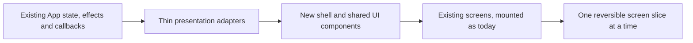

# UI redesign implementation roadmap

Status: roadmap only. No phase in this document is authorized by its inclusion here.

## Delivery strategy

Use a strangler-style presentation shell, not a rewrite:

The initial shell should not move services, alter persisted types, replace IPC, change setting keys, introduce a new database, or conditionally unmount Play. Each phase should be independently shippable, feature-flagged when risk warrants it, and reversible by restoring the previous presentation component.

## Phase control matrix

This matrix makes the review contract for every phase explicit. The detailed sections below remain authoritative for scope and guardrails.

| Phase | Screens affected | Components affected | Existing functionality at risk | Dependencies |
| --- | --- | --- | --- | --- |
| 1. Visual foundation | One low-risk pilot screen; later shared primitives only | tokens, PageHeader, Section, buttons, status, feedback, empty state, modal/drawer shell | CSS cascade, focus and control appearance; no domain behaviour should be in scope | Baseline screenshots and minimal renderer harness |
| 2. Navigation/layout shell | All destinations at shell level; screen internals unchanged | primary/secondary/utility nav, route adapter, compact/bottom nav, page headers | `activeView` side effects, Play webview mounting, focus and state preservation | Phase 1 primitives; destination mapping tests |
| 3. Shared consolidation | Spotlight, Community, Overlay, Settings categories, Match history one at a time | shared tables, filters, state presentation, operation feedback, surfaces | callback arguments/order, permission/enablement predicates, filtering and CSS cascade | Phases 1–2 and per-screen snapshots |
| 4. Onboarding/discovery | first run, Home, Spotlight content placement | stepper, readiness strip, next-action banner, active deck/recent match/activity/insight modules | accidental enabling of optional features, misleading readiness, partial-load handling | shared status model; existing Home inputs; phase 2 IA |
| 5. Live match | Play chrome and Match review presentation | provider/status strip, utility menu, details drawer, review layout/footer | capture/recording event wiring, popup timing, serialized match result, review action order | phases 1–4; match renderer/integration tests |
| 6. Deck/replay/account | Deck workspace; Replays landing/library/detail; Account & integrations | deck sections, artifact indicators, replay modes, media/delivery status, integration rows | deck/notebook persistence, tracker linkage, replay media/timeline/export, account consent/identity/cloud | stable shell; real-store and renderer coverage for each independent subphase |
| 7. Optional architecture | only the screen/service seam chosen for extraction | route serialization, view-model adapters, split screen modules/CSS | effect timing, state ownership, IPC sequencing and all behavior of the extracted seam | measured stability of phases 1–6; dedicated contract tests |

| Phase | Tests that must pass | New tests recommended | Rollback approach | Presentation-only or deeper work |
| --- | --- | --- | --- | --- |
| 1 | full existing suite; TypeScript/lint; visual/focus checks | primitive keyboard, severity and snapshot tests | remove scoped tokens/components; old CSS remains | Presentation-only |
| 2 | full existing suite plus match/capture/replay focused suites | every destination mapping; compact navigation; persistent Play webview; global review modal | switch back to old sidebar/shell component | Presentation-only if current state/effects stay in place |
| 3 | full existing suite plus focused domain suite for each migrated screen | action argument/order, filter, empty/error and permission-state tests | revert one migrated screen/component mapping at a time | Presentation-only; no shared component may own business rules |
| 4 | full suite; account/capture/replay status suites | onboarding local-only path; no implicit opt-in; Home partial-load and next-action tests | presentation flag restores old Home/FirstRun | Presentation-only |
| 5 | all match lifecycle/coordinator/deduper/seat/recovery suites | BO1/BO3/Scorepad review serialization, save failure, review later/delete, persistent webview/Electron smoke | restore old Play toolbar/review markup behind a flag | Presentation-only first; any effect extraction is a separate deeper change |
| 6 | deck, replay, account, cloud and store gates listed below | real deck/replay CRUD reload; media folder/Mac recovery; playback/coach/export; account consent patch parity; hub capability UI | independent flags/reverts for 6A–6D | Presentation-only first; split state/effects only after new tests |
| 7 | full suite plus contracts for the exact seam | extraction equivalence, effect timing, IPC call-order and packaged smoke tests | keep old owner/module until equivalence is proven; revert extraction independently | Deeper architecture, optional |

## Before phase 1: establish protection

The repository currently has strong service-level tests (29 Vitest files, 277 cases in the audited working tree) and no renderer/component, navigation, Electron end-to-end, or real embedded-webview tests. Add the smallest protection needed before changing shell behaviour.

### Baseline evidence to record

- Screenshot/reference at 1920×1080, 1440×900, 1180×800 and 900×700 for Home, Play, match review, Matches, Decks, Replays, Account and Settings.
- Current destination map and current focus/tab mapping.
- A manual smoke script that explicitly confirms the Play webview remains mounted while navigating.
- A copy of current setting patches for sensitive toggles.
- Current capture/replay/account focused test results.

### Minimal new smoke coverage

1. Renderer can open every current `ActiveView` destination.
2. Proposed navigation adapters map to the correct current view/tab/focus.
3. Leaving Play hides but does not unmount/recreate the game webview.
4. `match:draft` opens one global review modal from any destination.
5. Saving a minimal BO1/BO3 review invokes the existing confirm callback exactly once.
6. Account/Settings Web Replay controls construct the current compound setting patches until canonical ownership is changed deliberately.

Do not start by building a comprehensive front-end testing framework. Add a narrow renderer harness and a small Electron smoke path sufficient to protect the shell boundary.

## Phase 1 — purely visual foundation

**Scope:** presentation tokens and shared primitives with no navigation or screen rearrangement.

### Work

- Introduce a scoped next-generation token layer for type, spacing, flat surfaces, borders, status and focus.
- Add presentation primitives: PageHeader, Section, Button variants, StatusRow/Banner, OperationFeedback, EmptyState, FilterSummary, Modal/Drawer shell.
- Apply only to a low-risk surface such as Settings → Updates or a new nonfunctional component gallery behind development/test mode.
- Add global `:focus-visible`, reduced-motion support, and minimum text-size rules without altering the game/replay stages.

### Explicitly excluded

- no navigation change;
- no restructuring of `App` effects;
- no match review, Play, deck, replay, account or hub behaviour changes;
- no removal of old CSS selectors.

### Acceptance and rollback

- Visual snapshots and keyboard focus checks pass.
- Existing screens render unchanged unless explicitly migrated.
- Rollback removes the new scoped layer/components only.

**Risk:** Low.

## Phase 2 — navigation and layout shell

**Scope:** proposed primary/secondary IA as an adapter over existing state.

### Work

- Add five primary sections and the utility area.
- Translate proposed destinations to existing `ActiveView`, `CommunityTab`, and `DeckFocusTarget` values.
- Add persistent compact and narrow-width navigation; never hide all navigation.
- Keep the existing Play grid mounted in the same root position and preserve pointer/focus/DOM-ready handlers.
- Update stale page titles/descriptions and consistent product terminology.
- Add data-source and Local/Web replay labels.

### Explicitly excluded

- no React router requirement;
- no URL/deep-link persistence requirement;
- no data fetching changes;
- no direct component extraction from business-heavy screens;
- no automatic background behaviour based on the new group labels.

### Acceptance and rollback

- All current visible features remain reachable in two purposeful steps or fewer.
- Switching primary/secondary destinations preserves current screen state as before.
- Play remains mounted and capture/recording event bindings remain unchanged.
- At 900px and below, navigation remains available.
- Feature flag or one component switch restores the old sidebar.

**Risk:** Medium because `activeView` changes currently trigger tracker scans, community loads, diagnostics refresh and replay-video arming/stopping.

## Phase 3 — shared component consolidation

**Scope:** replace repeated presentation patterns while retaining existing actions/selectors.

### Work

- Consolidate buttons, status text, operation feedback, empty states, page headers, filters, tables and modal framing.
- Replace generic string-only async feedback with a view adapter carrying severity/scope/action; continue accepting current service messages.
- Migrate one low/medium-risk screen at a time: Spotlight → Community views → Overlay → Settings categories → Match history layout.
- Introduce one source/provenance component for Personal, Scorepad, Community, Team and Hub data.
- Reduce nested card styling as each screen migrates; leave untouched screen CSS in place.

### Guardrails

- Call existing callbacks with identical arguments and ordering.
- Do not reimplement permissions, enablement predicates, analytics, filters or result calculations in shared UI components.
- Do not delete old CSS until all selectors are proven unused and diffs are isolated.

### Acceptance and rollback

- Per-screen visual and interaction regression checklist passes.
- Operation failure no longer uses success visuals.
- Active filters, empty state and error recovery remain functional.
- Each migrated screen can be restored independently.

**Risk:** Medium.

## Phase 4 — onboarding and discovery

**Scope:** new first-run presentation and operational Home dashboard.

### Work

- Build the onboarding steps around existing settings/account/provider checks.
- Preserve local-only continuation and current privacy defaults.
- Replace Home hierarchy with readiness, next action, active deck, recent matches, replay/integration activity and one insight.
- Move most editorial modules to Spotlight; retain one compact Home feature.
- Add contextual education for Local versus Web replay and local versus account identity.

### Guardrails

- Onboarding changes emphasis only unless the user explicitly toggles an existing setting.
- No account requirement for local capture.
- No auto-enabling Web Replay, Discord sharing, cloud backup, local video, community sync or tracker.
- No computed “health score” or inferred readiness beyond existing state.

### Acceptance and rollback

- New user can reach Play locally without account/network.
- Dashboard uses actual current match/deck/replay/health data and handles partial load failure.
- Pending review and capture attention outrank promotional content.
- Old Home/FirstRun can be restored behind a presentation flag.

**Risk:** Medium.

## Phase 5 — sensitive live match surfaces

**Scope:** Play chrome and match review presentation only, after shell protection is proven.

### Work

- Introduce the status strip and reorganize Play controls without moving the webview or effects.
- Present capture phases and BO3 waiting in user language through an adapter over existing health/notice state.
- Restyle Match review in place: required fields, optional details, artifact explanation and stable footer.
- Add focused UI tests for BO1, BO3, Scorepad, validation, save failure, review later and delete.

### Frozen behaviour

- match detection and lifecycle;
- popup suppression/timing;
- series/game identity and dedupe;
- score/result/seat/battlefield normalization;
- provider partitions and bridge;
- video capture arming/finalization;
- force-review behaviour;
- confirm/delete callback order.

### Acceptance and rollback

- Complete the full match-protection test gate below.
- Manual packaged/dev smoke covers one TCGA BO1, Atlas BO1 and Atlas BO3 without changing expected result timing.
- Presentation flag restores old Play toolbar/review markup while retaining data.

**Risk:** High. Keep this phase small and separate from deck/replay work.

## Phase 6 — sensitive deck and replay surfaces

Split this into independent releases.

### 6A. Deck workspace presentation

- Turn scroll shortcuts into stable internal sections while preserving one `DecksView` data owner initially.
- Add Overview and consistent active-deck consequences.
- Reframe Prep, Notebook and Performance without altering their schemas/actions.
- Test import, refresh, active selection, notebook save/reload, version creation, prep fallback and tracker linkage.

**Frozen:** deck IDs/source keys, snapshot formats/hashes, activeDeckId, notebook/prep schema, tracker and overlay contracts.

### 6B. Replay landing and local library

- Present Local and Web replay as siblings under Review while retaining separate views.
- Add list-level media and delivery status.
- Improve missing-media/import state without changing matching or filesystem behavior.

**Frozen:** replay records/files, import/recovery, raw capture manifests, account consent, visibility and delivery stages.

### 6C. Local replay detail modes

- Add Watch/Coach/Export layouts over existing player and local state.
- Do not change marker timing, IDs, layers, annotations, audio, clip/export or raw upload/share ordering.
- Add playback/flag/export failure UI tests before component extraction.

### 6D. Account & integration presentation

- Create canonical account header and independent integration rows.
- Make Account the editing owner of Web Replay/Discord settings; change Settings duplicates to summaries only after parity tests prove identical guardrails.
- Put technical identity details under disclosure.

**Frozen:** canonical/alias verification, link/reconnect/switch/unlink, consent UID checks, cloud generations/restore and local data preservation.

**Risk:** High; ship each subphase separately.

## Phase 7 — optional architecture improvements

Only pursue after measured evidence that presentation work is stable.

Possible seams:

- Extract navigation serialization and route adapters from `App`.
- Create view-model hooks that read existing state/callbacks without owning domain rules.
- Extract pure renderer helpers currently embedded in `App` and add tests before moving them.
- Split CSS by tokens/primitives/screen while preserving cascade order during migration.
- Extract Account, Settings, Matches, Decks and Replay screens one at a time.
- Add a real route/history model if deep-linking/back navigation has user value.

Do not:

- rewrite the application around a new state manager merely to support the redesign;
- merge local/Web/legacy replay systems;
- move capture/session logic into renderer hooks;
- replace IPC/contracts/storage as part of UI cleanup;
- enable hidden Vision, local Replay Lab, combiner or moderation surfaces;
- remove backward-compatible identity/hub/deck/replay fields.

**Risk:** Variable; each extraction requires its own behavior contract and rollback.

## Required regression gate

### Match detection, lifecycle and review

| Behaviour | Existing protection | Additional UI protection before sensitive phase |
| --- | --- | --- |
| TCGA/Atlas match identity, scores, opponents, reset/concede | `tests/matchSessionTracker.test.ts` | renderer receives one correct draft summary |
| BO1/BO3 hold/release, sideboarding, result echoes, equal-score games | `matchSessionTracker`, `captureCoordinator` | status strip wording and one modal at terminal review only |
| duplicate/racing Atlas frames | `atlasFrameDeduper` | none unless Play event wiring changes |
| Atlas seat | `atlasSeatTracker` | review seat field displays/preserves value |
| popup decision and fallback on storage failure | `captureCoordinator` | modal error/retry and review-later interaction |
| manual BO3 repair/undo | `matchCombine` | selected-row action/modal smoke |
| match edit ordering | `matchList` | history edit retains position |
| result storage/recovery | `storeRecovery` partially | real-store review save/reload and delete/restore smoke |

Mandatory focused suites:

- `tests/matchSessionTracker.test.ts`
- `tests/captureCoordinator.test.ts`
- `tests/matchList.test.ts`
- `tests/matchCombine.test.ts`
- `tests/atlasFrameDeduper.test.ts`
- `tests/atlasSeatTracker.test.ts`
- `tests/atlasWebviewRecovery.test.ts`
- `tests/tcgaIdentity.test.ts`
- `tests/tcgaResolver.test.ts`

### Deck persistence and tracker

| Behaviour | Existing protection | Gap to close |
| --- | --- | --- |
| deck matching/events/odds/manual corrections/sideboard effective deck | `deckTracker` | renderer controls and saved corrections/pins persistence |
| per-game opponent memory | `deckTrackerService` | full service/UI lifecycle |
| Atlas event extraction | `atlasEventDeckTracker` | overlay navigation/state |
| notebook versions/prep normalization/images/sanitization | `deckNotebook` | real store save/reload, import/refresh/rename/delete/active deck |
| performance attribution | `deckPerformance` | UI source/sample labels |
| parked Vision safe state | `visionDeckTracker` | ensure redesign does not expose/enable it |

Mandatory suites:

- `tests/deckTracker.test.ts`
- `tests/deckTrackerService.test.ts`
- `tests/atlasEventDeckTracker.test.ts`
- `tests/deckNotebook.test.ts`
- `tests/deckPerformance.test.ts`

### Replay creation, retrieval and delivery

| Behaviour | Existing protection | Gap to close |
| --- | --- | --- |
| Atlas raw capture, account consent, privacy, checksum/idempotent upload | `rawCaptureService` | UI enablement/confirmation parity |
| keyed BO3 sessions and persistent manifests | `rawCaptureService` | list/detail status after restart |
| finalized result and Discord delivery stages | `rawCaptureService`, `replayDelivery`, `replaySharing` | delivery-stage UI and retry action |
| secure embed bootstrap/account switch | `replayEmbedSession` | embedded blank/offline/navigation failure |
| reconstruction | `atlasReplay`, `riftLiteReplayEngine` | normal player UI/seek smoke; keep old engine hidden |
| loose media recovery | `replayMediaRecovery` | folder discovery, permissions, database reattachment and Mac path workflow |
| recorder stop races | `mediaRecorderStop` | real Chromium/Electron recording smoke |
| local replay CRUD/import/playback/coaching/export | limited | real-store and renderer/Electron coverage required |

Mandatory suites:

- `tests/rawCaptureService.test.ts`
- `tests/replayDelivery.test.ts`
- `tests/replaySharing.test.ts`
- `tests/replayEmbedSession.test.ts`
- `tests/replayMediaRecovery.test.ts`
- `tests/mediaRecorderStop.test.ts`
- `tests/atlasReplay.test.ts`
- `tests/riftLiteReplayEngine.test.ts`

### Account, settings and data safety

| Behaviour | Existing protection | Gap to close |
| --- | --- | --- |
| account states/anonymous rejection/canonical verified alias | `accountIdentity` | link/profile/reconnect UI transitions |
| immutable cloud generations/conflicts/restore/token races | `accountCloudSync` | full-entity round trip and conflict UI |
| private raw capture default on migration | `storeRecovery` | settings UI persistence |
| local backup safety and startup recovery | `storeRecovery` | ordinary deck/replay/settings CRUD/reload |
| Hub roles/Health/Discord/account alias | little/no desktop tests | service/emulator plus permission-aware UI tests |
| navigation/settings | no direct tests | destination mapping, compact nav, dependency/patch semantics |

Mandatory suites:

- `tests/accountIdentity.test.ts`
- `tests/accountCloudSync.test.ts`
- `tests/storeRecovery.test.ts`

## UI coupling risk register

| Hotspot | Why risky | Mitigation |
| --- | --- | --- |
| Root `App` capture listeners and media recorder | presentation events start/stop media and refresh domain state | do not extract/move effects in shell phases; lock event wiring with tests |
| `activeView` effects | navigation triggers scans, remote loads, diagnostics and recording arming | adapter maps to current view values; preserve transition order |
| always-mounted Play grid | conditional routing could stop capture or lose provider state | assert one persistent webview instance across navigation |
| global review modal | must interrupt any destination and preserve draft | keep at root until dedicated integration coverage exists |
| review normalization/helpers in renderer | field/layout changes can alter stored results | restyle in place, test serialized confirmed draft |
| DashboardView’s broad prop/action surface | shell refactor can omit callback/data | typed adapter plus exhaustive mapping test |
| Account/Settings direct IPC and compound patches | duplicate controls can diverge or weaken consent | snapshot/test exact patches before canonicalizing ownership |
| Replay detail local state | timeline, layers, flags, notes and upload/share interact | layout modes only; no state ownership change in first replay phase |
| Hubs permissions | visible role names are not sufficient capability truth | continue consuming service/server capability results |

## Release discipline for future implementation

For each phase:

1. inspect the dirty tree and isolate only intended files;
2. state frozen behaviour in the change description;
3. add/adjust focused tests before risky markup movement;
4. run focused suites, full test suite, TypeScript/lint and production build;
5. run viewport, keyboard and screen-reader smoke checks proportional to the phase;
6. test startup, Home, Play provider switch, match review, Match history, Local/Web replay, Decks, Account and Settings;
7. package only when explicitly requested;
8. publish/deploy only when explicitly requested;
9. keep the previous presentation behind a short-lived rollback flag for medium/high-risk phases;
10. remove the flag only after real-user validation.

## Recommended first implementation slice

The first reversible slice should be:

1. add scoped visual tokens and shared `PageHeader`, `StatusRow`, `EmptyState`, and `OperationFeedback` components;
2. build a new Home dashboard presentation using the data already passed to `HomeView`;
3. add the proposed navigation as an optional shell adapter, but leave existing screens and Play mounting unchanged;
4. do not touch match review, capture controls, deck persistence, replay detail, Account mutations, or Settings patches;
5. retain a single switch that restores the old Home/sidebar.

This slice demonstrates the product structure and readiness model while keeping all sensitive business paths intact.

## Validation performed for this proposal

No builds, tests, packages, deployments, publishes or production operations were run. Validation for this documentation task was read-only: current docs, renderer source, global styles and existing test inventory were inspected. Future implementation must use the gates above.
